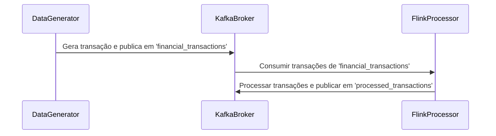

# Exemplo de Processamento de Streaming com Kafka e Flink em Python

Este exemplo demonstra um fluxo básico de ponta a ponta para o processamento de dados em tempo real usando o Apache Kafka e o Apache Flink em Python.

## Requisitos

- Python 3.x
- [Confluent Kafka Python](https://github.com/confluentinc/confluent-kafka-python)
- [PyFlink](https://ci.apache.org/projects/flink/flink-docs-release-1.14/dev/python/table-api-users-guide/setup.html)
- [Faker](https://github.com/joke2k/faker)

## Uso

### Passo 1: Geração de Dados

Execute o script `data_generator.py` para gerar transações de vendas sintéticas e publicá-las em um tópico Kafka chamado `financial_transactions`. Ajuste os parâmetros do script conforme necessário.

```bash
python data_generator.py
```

### Passo 2: Processamento de Streaming com Flink

Execute o script `flink_stream_processor.py` para consumir as transações financeiras do tópico Kafka, processá-las usando o Flink e publicar os resultados processados em um novo tópico Kafka chamado `processed_transactions`.

```bash
python flink_stream_processor.py
```

## Script de Geração de Dados (`data_generator.py`)

Este script em Python gera transações de vendas aleatórias usando a biblioteca Faker e as publica em um tópico Kafka. Cada transação inclui detalhes como ID da transação, informações do produto, ID do cliente e método de pagamento.

## Script de Processamento de Streaming com Flink (`flink_stream_processor.py`)

Este script em Python utiliza o Apache Flink para consumir transações financeiras do tópico Kafka `financial_transactions`, processa cada transação (neste caso, simplesmente adicionando um prefixo "Processado:") e publica os resultados no tópico Kafka `processed_transactions`.

## Diagrama de Sequência: Processamento de Streaming com Kafka e Flink



## Observações

- Certifique-se de configurar um servidor Kafka em `localhost:9092` antes de executar os scripts.
- Ajuste as configurações do servidor de bootstrap do Kafka (`bootstrap.servers`) e outros parâmetros conforme necessário nos scripts.

Sinta-se à vontade para personalizar os scripts e explorar recursos adicionais do PyFlink e do Confluent Kafka Python conforme necessário para o seu caso de uso específico.